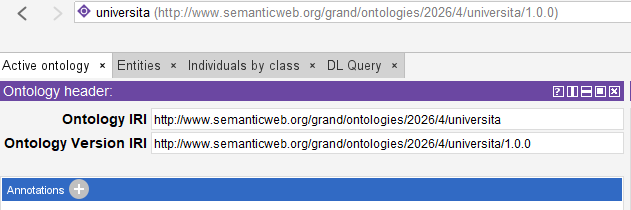

# 2. Creazione di un'ontologia in Protégé

### Ultimo aggiornamento del 16 Maggio 2026 alle ore 17:37

---

Per creare una nuova ontologia in Protegé, cliccare su File > New. 
Successivamente, definire l'IRI dell'ontologia cliccando sulla scheda <b>Active Ontology</b>. Per esempio, nel campo <b>Ontology IRI</b> digitare <code>http://www.semanticweb.org/grand/ontologies/2026/4/universita</code> invece, in <b>Ontology Version IRI</b> digitare <code>http://www.semanticweb.org/grand/ontologies/2026/4/universita/1.0.0</code>, che designa la versione 1.0.0 della nostra ontologia.

________________
<h3><a href="./03_creazione_classi.md">Passa al capitolo successivo</a></h3>
<h3><a href="./01_intro_owl_protege_setup.md">Ritorna al capitolo precedente</a></h3>
<h3><a href="../index.md">Ritorna all'indice</a></h3>