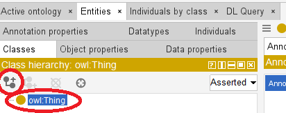
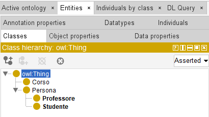

# 3. Creazione delle Classi di un'ontologia (gerarchia)

### Ultimo aggiornamento del 17 Maggio 2026 alle ore 16:34

---

In primis, clicchiamo sulla scheda <b>Entities</b>, poi, sulla sottoscheda <b>Classes</b>. 
Se siete al punto giusto, vedrete <code><b>owl:Thing</b></code>, la quale è una superclasse assoluta: tutte le cose che creeremo saranno sottoclassi di owl:Thing, ed è l'equivalente della classe <b>Object</b> nel Web Semantico. 
Se creeremo delle classi come Auto o Persona, esse saranno figlie/sottoclassi di <code>owl:Thing</code>. 
Il suo opposto è <code>owl:Nothing</code>, l'insieme vuoto che non contiene alcun elemento.

Come nell'immagine sottostante, clicchiamo su <code>owl:Thing</code> e poi <code>Add Subclass</code> (tasto cerchiato in rosso)

Digitiamo quindi il nome della prima classe, ovvero <code>Persona</code>. 
Per creare delle <b>sottoclassi</b> di <code>Persona</code>, clicchiamo su quest'ultima col tasto destro del mouse, poi, clicchiamo su <code>Add Subclass</code>, creiamo quindi due sottoclassi di <code>Persona</code>, ovvero <code>Studente</code> e <code>Professore</code>.

Infine, creiamo un'altra sottoclasse di <code>owlThing</code> che chiameremo <code>Corso</code>. 
A video dovrebbe presentarsi la seguente situazione.

________________
<h3><a href="./04_creazione_proprieta.md">Passa al capitolo successivo</a></h3>
<h3><a href="./02_creazione_ontologia.md">Ritorna al capitolo precedente</a></h3>
<h3><a href="../index.md">Ritorna all'indice</a></h3>