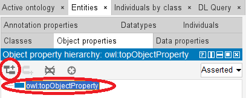
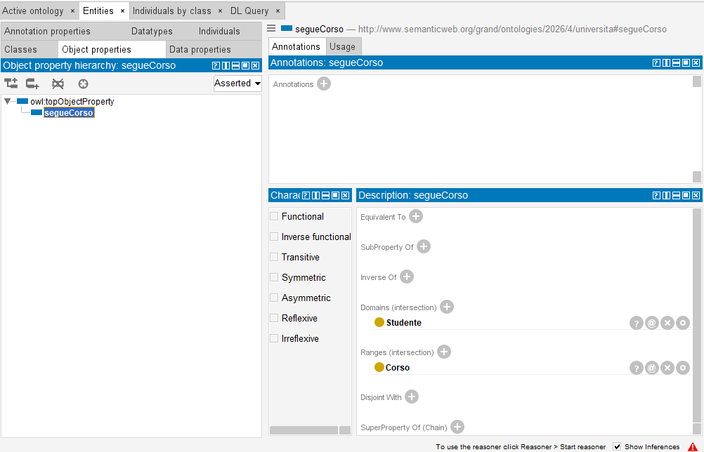
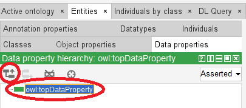
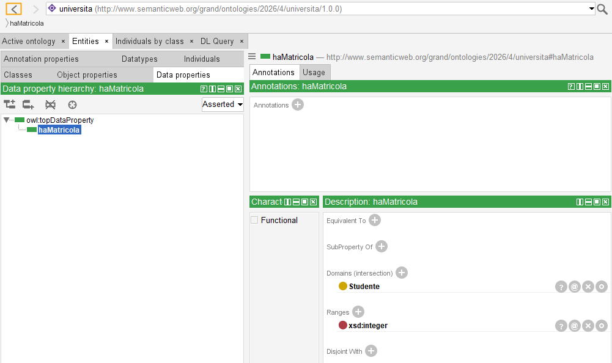

# 4. Creazione delle proprietà (relazioni e attributi)

### Ultimo aggiornamento del 17 Maggio 2026 alle ore 17:30

---

Dopo aver creato le classi dell'ontologia dobbiamo collegarle e, in seguito, aggiungere delle proprietà ad esse.

Andiamo con ordine, e cominciamo con la creazione di una <b>Object Property</b>, ovvero una <b>relazione tra concetti</b>: per cominciare, clicchiamo su <code>Object properties</code>, la sottoscheda contenuta in <code>Entities</code>. 
Selezioniamo <code>owl:topObjectProperty</code> (proprietà radice di tutte le object property) e, infine, clicchiamo sul bottone <code>Add sub property</code>

Creiamo quindi la <b>sottoproprietà</b> <code>segueCorso</code> 
Adesso, dobbiamo definire il <b>Domain</b> e il <b>Range</b>: ma cosa sono di preciso?
<ul>
<li><b>Domain</b> (dominio) designa l'inizio della relazione;</li>
<li><b>Range</b> (codominio) designa la fine della relazione.</li>
</ul>
Per l'object property <code>segueCorso</code> designeremo <code>Studente</code> come <b>Domain</b> e <code>Corso</code> come <b>Range</b>. 
Lo studente segue il corso = lo <code><b>DOMAIN</b> Studente</code> <code><b>OBJECT PROPERTY</b> segueCorso</code> il <code><b>RANGE</b> Corso</code>.  
Clicchiamo su <code>segueCorso</code>, portiamoci sulla scheda <code>Annotations</code>, quindi
<ul>
<li>clicchiamo + su Domains e scriviamo <code>Studente</code>;</li>
<li>clicchiamo + su Ranges e scriviamo <code>Corso</code></li>
</ul>
Il risultato a video sarà il seguente:

Complimenti, avete definito una relazione tra concetti.

Adesso, dedichiamoci alla creazione delle <b>Data Property</b>, ovvero le caratteristiche letterali di una classe. 
Clicchiamo sulla scheda <code>Data Properties</code> e clicchiamo su <code>owl:topDataProperty</code>, quindi su <code>Add sub property</code> e creiamo <code>haMatricola</code>.

Impostiamo quindi il <b>Domain</b> cliccando sul + posto vicino a <b>Domains</b> e scriviamo <code>Studente</code>. 
Infine, clicchiamo sul tasto + posto vicino a <b>Ranges</b> e, nella finestra che si aprirà, clicchiamo sulla scheda <b>Built in datatipes</b>: qui dobbiamo selezionare un tipo di dato, per esempio, <code>xsd:integer</code> per definire la matricola con un numero intero (es. 1234567890), oppure, <code>xsd:string</code> per definire un tipo di dato stringa (es. MARROS1234567890). 
Per terminare l'esempio, selezioniamo un tipo di dato <code>xsd:integer</code>.

La situazione a video sarà la seguente:

________________
<h3><a href="./05_popolare_ontologia.md">Passa al capitolo successivo</a></h3>
<h3><a href="./03_creazione_classi.md">Ritorna al capitolo precedente</a></h3>
<h3><a href="../README.md">Ritorna all'indice</a></h3>