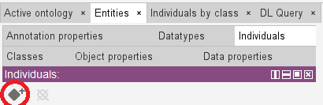
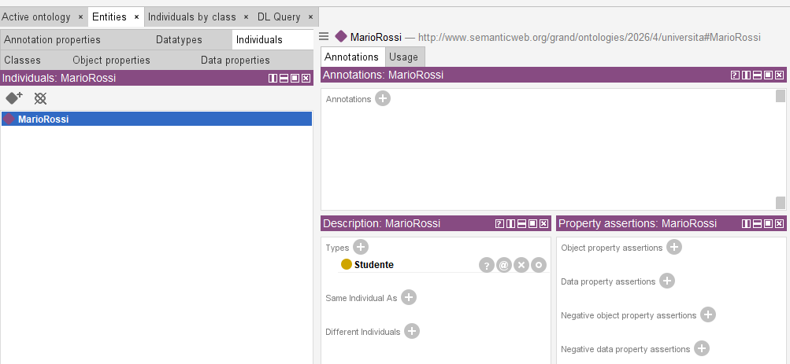
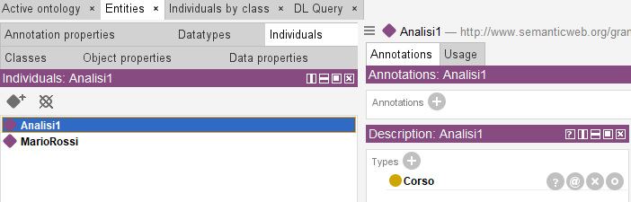

# 5. Popolare l'ontologia (individui)

### Ultimo aggiornamento del 17 Maggio 2026 alle ore 15:34

---

È arrivato il momento di popolare l'ontologia con degli <b>individui</b>. 

Clicchiamo sulla scheda <code>Individuals</code> contenuta in <code>Entities</code> e clicchiamo su <code>Add individual</code>, quindi creiamo l'individuo <code>MarioRossi</code>. 

Successivamente, per collegare quest'ultimo alla <b>classe</b> <code>Studente</code>, clicchiamo sull'individuo <code>MarioRossi</code>, quindi, nella colonna <b>Description</b> posta a destra clicchiamo sul + vicino a <code>Types</code>, infine, digitiamo <code>Studente</code> nella finestra che si aprirà. 
La situazione dovrebbe essere la seguente:

L'individuo <code>MarioRossi</code>, adesso, è collegato alla classe <code>Studente</code>: Mario Rossi è uno studente. 

Infine, creiamo un individuo <code>Analisi1</code> e colleghiamolo alla classe <code>Corso</code>: ci tornerà utile per illustrare il prossimo argomento.

________________
<h3><a href="./06_collegare_individui.md">Passa al capitolo successivo</a></h3>
<h3><a href="./04_creazione_proprieta.md">Ritorna al capitolo precedente</a></h3>
<h3><a href="../index.md">Ritorna all'indice</a></h3>