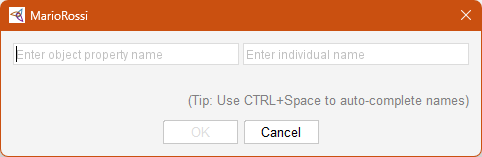
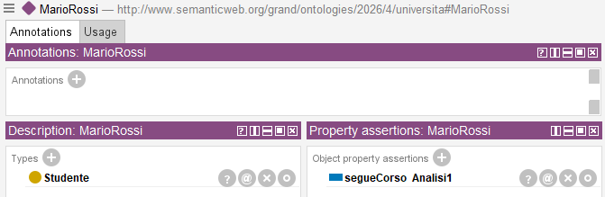
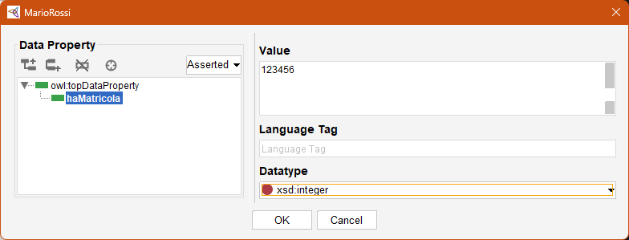
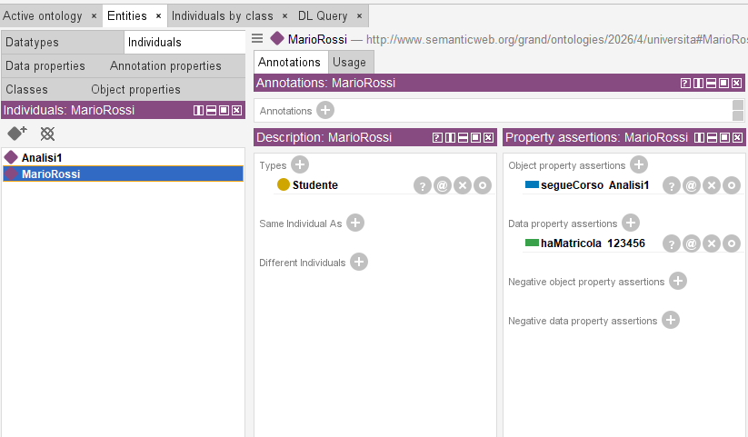

# 6. Collegare gli individui a object e data properties

### Ultimo aggiornamento del 17 Maggio 2026 alle ore 15:52

---

Mario Rossi è uno Studente, ma che studente è se non ha una matricola, né un corso da seguire? 

Prima di proseguire, clicchiamo su <b>Entities</b> > <b>Individuals</b> > <b>MarioRossi</b>: noteremo la finestra <b>Property assertion</b> in basso a destra, essa ci servirà per effettuare i collegamenti con le proprietà oggetti e dati.

Cominciamo col collegare l'individuo <code>MarioRossi</code> a un <b>object property</b> che, in questo esempio, sarà il <code>Corso</code> <code>Analisi1</code>:
<ul>
<li>clicchiamo sul tasto + vicino a <code>Object property assertions</code>, si aprirà una finestra come quella sottostante; </li>

<li>nel campo a sinistra inseriremo la relazione (object property) <code>segueCorso</code>;</li>
<li>nel campo a destra inseriremo l'individuo di arrivo, per esempio, <code>Analisi1</code></li>
<li>assicuratevi che il risultato sia il medesimo della schermata sottostante.</li>

</ul>

Adesso, passiamo all'inserimento del <b>Data Property</b> <code>haMatricola</code> per l'individuo <code>MarioRossi</code>:
<ul>
<li>clicchiamo sul tasto + vicino a <code>Data property assertions</code>;</li>
<li>clicchiamo sul <b>Data property</b> <code>haMatricola</code> e, dato che al <a href="./04_creazione_proprieta.md">capitolo 4</a> abbiamo definito questo tipo di dato come <code>xsd:integer</code>, replichiamo la scelta con la tendina <code>Datatype</code>, infine, inseriamo una matricola <code>123456</code>.</li>

</ul>
L'individuo <code>MarioRossi</code> dovrebbe restituire i parametri riportati nella videata sottostante.

 
Da ciò possiamo dedurre che lo studente Mario Rossi, matricola 123456, segue il corso di Analisi I: la lettura è semplice e di facile deduzione. 

________________
<h3><a href="./07_ragionatore_inconsistenza.md">Passa al capitolo successivo</a></h3>
<h3><a href="./05_popolare_ontologia.md">Ritorna al capitolo precedente</a></h3>
<h3><a href="../README.md">Ritorna all'indice</a></h3>