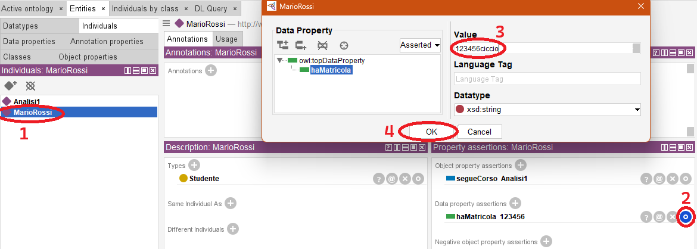
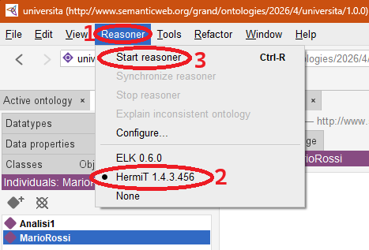
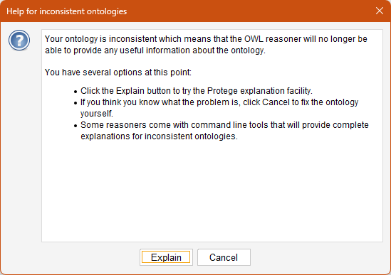
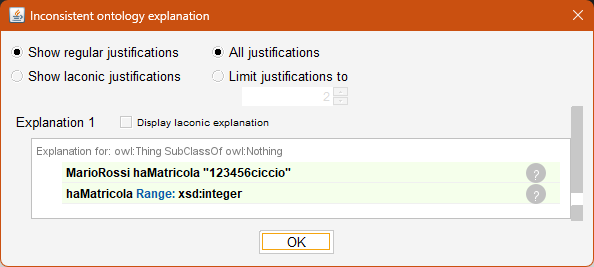

# 7. Il ragionatore (reasoner): testare l'ontologia e scoprirne le inconsistenze

### Ultimo aggiornamento del 20 Maggio 2026 alle ore 12:03

---

In Protégé disponiamo del <b>reasoner</b>, un motore di inferenza molto potente che ci permette di analizzare le regole logiche della nostra ontologia al fine di:
<ul>
<li>testare la coerenza dei dati inseriti nell'ontologia;</li>
<li>dedurre automaticamente nuove informazioni in maniera implicita in base alle informazioni già presenti.</li>
</ul>
Cominciamo ad utilizzare il ragionatore per lo scopo più semplice, ovvero il primo della lista sovrastante. 
Andiamo su <b>Entities</b> > <b>Individuals</b> > <code>MarioRossi</code>, poi, clicchiamo sull'ultima icona in corrispondenza di <code>haMatricola 123456</code> per editare il <b>Data property</b> legato a <code>MarioRossi</code>. 
Assegniamo un <b>Value</b> <code>123456ciccio</code> al <b>Data Property</b> <code>haMatricola</code>, quindi confermiamo la scelta.

 

Andiamo su <b>Reasoner</b> > selezioniamo <b>HermiT</b> > <b>Start reasoner</b> 

Verremo subito avvertiti dell'inconsistenza della nostra ontologia con la seguente schermata: 
 

Dopo aver cliccato su <b>Explain</b>, possiamo vedere che abbiamo inserito un dato di tipo stringa <code>123456ciccio</code> in un <b>Data property</b> <code>haMatricola</code> di tipo <code>xsd:integer</code>. 
 
Complimenti, avete scovato un'inconsistenza nella vostra ontologia con l'aiuto del ragionatore.

________________
<h3><a href="./08_ragionatore_invers_relaz.md">Passa al capitolo successivo</a></h3>
<h3><a href="./06_collegare_individui.md">Ritorna al capitolo precedente</a></h3>
<h3><a href="../README.md">Ritorna all'indice</a></h3>