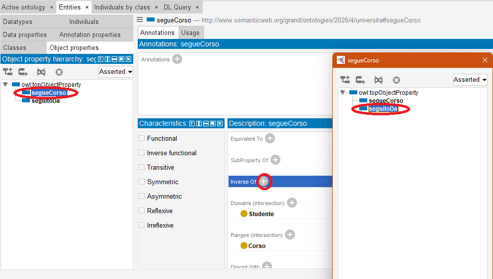
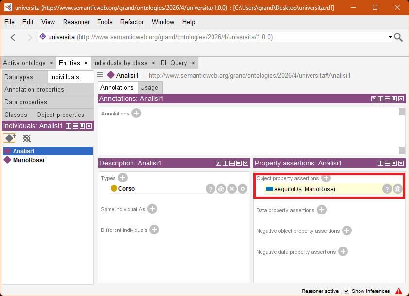
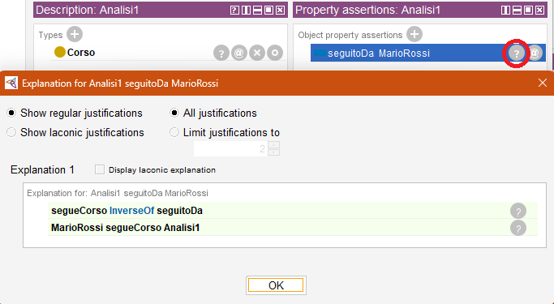

# 8. Il ragionatore (reasoner): inversione delle relazioni (proprietà inverse)

### Ultimo aggiornamento del 17 Maggio 2026 alle ore 17:08

---

Arrivati a tale punto, credo sia chiaro che lo studente Mario Rossi segua il corso di Analisi I. 
Quindi, inferisco che il corso di Analisi I sia seguito dallo studente Mario Rossi. 

Invece di inserire quest'ultima informazione in maniera manuale, desidero che il ragionatore la deduca da sé. 

Andiamo su <b>Entities</b> > <b>Object properties</b> > clicchiamo col tasto destro su <b>owl:topObjectProperty</b> > <b>Add sub-properties</b> > digitiamo <code>seguitoDa</code> e confermiamo tutto per creare la nuova proprietà. 

Clicchiamo sulla proprietà <code>segueCorso</code> e nel riquadro <b>Description</b> clicchiamo il + vicino a <b>Inverse of</b>, selezioniamo quindi la proprietà <code>seguitoDa</code>.
 

Prima di avviare il reasoner come nel capitolo 7, spuntiamo l'opzione <b>Show Inferences</b> posta in basso a destra nella finestra principale di Protégé, poi avviamo HermiT. 
Se tutto è andato bene, vedremo una riga evidenziata in giallo nella scheda <b>Propeerty assertions</b> dell'individuo <b>Analisi1</b> che riporta <code>seguitoDa MarioRossi</code>: il ragionatore sta funzionando correttamente e sta inferendo una nuova informazione.
 

Inoltre, dopo aver cliccato sull'icona col punto interrogativo, potremo vedere come Protégé ha inferito questa informazione:
<ol>
<li><code>MarioRossi</code> segue il corso <code>Analisi1</code>;</li>
<li><code>segueCorso</code> è l'inverso di <code>seguitoDa</code>;</li>
<li>quindi il corso <code>Analisi1</code> è seguito da <code>MarioRossi</code>.</li>
</ol>

 

________________
<h3><a href="./09_ragionatore_inf_clasprop.md">Passa al capitolo successivo</a></h3>
<h3><a href="./07_ragionatore_inconsistenza.md">Ritorna al capitolo precedente</a></h3>
<h3><a href="../README.md">Ritorna all'indice</a></h3>