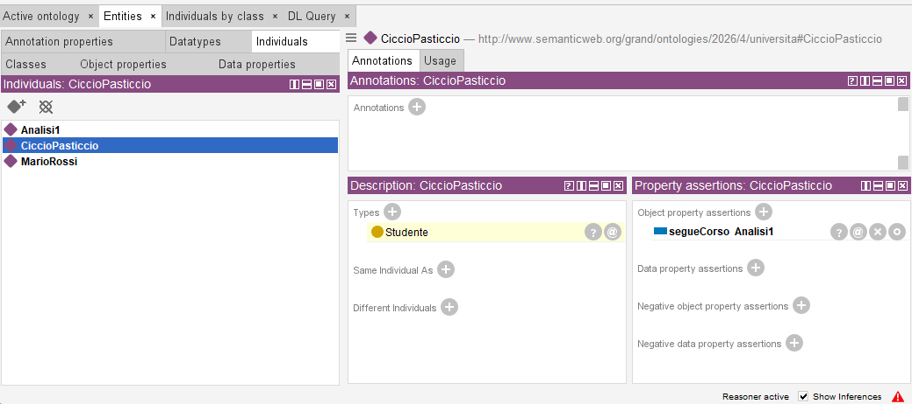
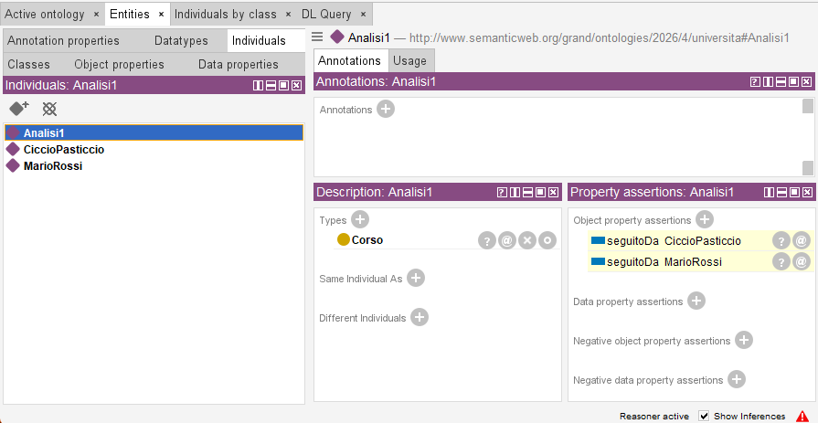
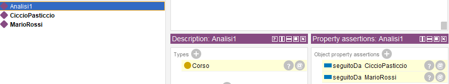

# 9. Il ragionatore (reasoner): inferire classi e proprietà

### Ultimo aggiornamento del 17 Maggio 2026 alle ore 22:39

---

Nel capitolo 6 abbiamo assegnato manualmente l'individuo <code>MarioRossi</code> alla classe <code>Studente</code>: come potremmo riconoscere automaticamente uno studente in base a quello che fa?

Andiamo su <b>Entities</b> > <b>Individuals</b> > clicchiamo sull'icona <b>Add individuals</b> (icona col rombo e il + in alto a destra) > creiamo l'individuo <code>CiccioPasticcio</code>. 
Clicchiamo su <code>CiccioPasticcio</code> e nella finestra <b>Property assertions</b> clicchiamo il + vicino a <b>Object property assertions</b>: nel primo campo digitiamo <code>segueCorso</code>, nel secondo <code>Analisi1</code>. 
Confermiamo e avviamo il reasoner come abbiamo fatto nei precedenti capitoli: vedremo una riga gialla <code>Studente</code> sotto <b>Types</b>. 
 
Comprendere il trucco magico dietro ciò non è assolutamente difficile: nel capitolo 4, durante la creazione della proprietà oggetto <code>segueCorso</code> abbiamo definito <code>Studente</code> come <b>Domain</b> e <code>Corso</code> come <b>Range</b>. 
Pertanto, se a un individuo associamo la proprietà oggetto <code>segueCorso</code> <code>Analisi1</code>, il reasoner inferisce automaticamente che  quell'individuo è uno studente proprio perché segue il corso.

Adesso, clicchiamo sull'individuo <code>Analisi1</code>: vedremo che HermiT ha inferito automaticamente che il corso <code>Analisi1</code> è <code>seguitoDa</code> <code>MarioRossi</code> e <code>CiccioPasticcio</code>.
 
Ricordiamo un aspetto particolare: nel capitolo 8, durante la creazione dell'<b>object property</b> <code>seguitoDa</code>, non abbiamo definito né un <b>Range</b>, né un <b>Domain</b>. 
Tuttavia, abbiamo definito che <code>seguitoDa</code> è un inverso di <code>segueCorso</code> e, dato che in quest'ultima proprietà abbiamo definito il <code><b>DOMAIN</b> Studente</code> e il <code><b>RANGE</b> Corso</code>, HermiT inferisce automaticamente che <code>Analisi1</code> è seguito da <code>MarioRossi</code> e <code>CiccioPasticcio</code> perché <code>seguitoDa</code> è l'inverso di <code>segueCorso</code>. 

Facciamo una pazzia e togliamo il <b>Type</b> <code>Corso</code> dall'individuo <code>Analisi1</code>: HermiT inferirà che <code>Analisi1</code> è di tipo <code>Corso</code> perché <code>Corso</code> è definito come <b>Range</b> nella <b>proprietà oggetto</b> <code>segueCorso</code>. 
 
Spero che questi ragionamenti assai cervellotici siano chiari. 

________________
<h3><a href="./10_ragionatore_catlog.md">Passa al capitolo successivo</a></h3>
<h3><a href="./08_ragionatore_invers_relaz.md">Ritorna al capitolo precedente</a></h3>
<h3><a href="../index.md">Ritorna all'indice</a></h3>