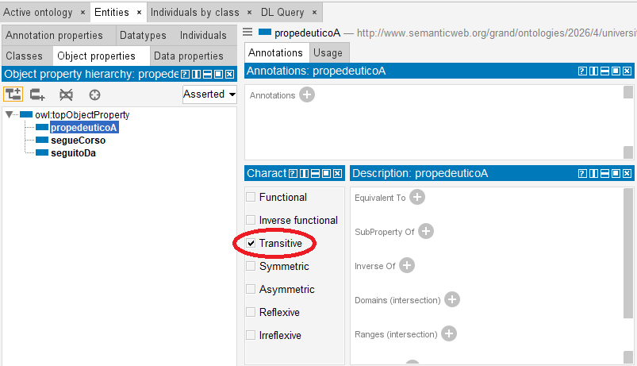
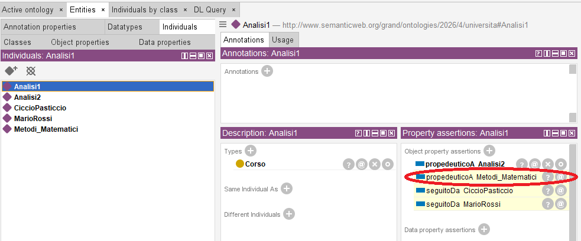

# 10. Il ragionatore (reasoner): la catena logica (proprietà transitive)

### Ultimo aggiornamento del 17 Maggio 2026 alle ore 23:30

---

Analisi I è un corso propedeutico ad Analisi II, quest'ultimo è propedeutico a Metodi Matematici e, data la sequenza instaurata dalla proprietà transitiva, lo è anche il primo. 

Instauriamo quindi questa sequenza su Protégé.

Andiamo su <b>Entities</b> > <b>Object properties</b> > clicchiamo su <b>Add sub property</b> > creiamo la proprietà oggetto <code>propedeuticoA</code> > clicchiamo su <code>propedeuticoA</code> > spuntiamo <b>Transitive</b> nella casella <b>Characteristics</b>. 

Spostiamoci su <b>Entities</b> > <b>Individuals</b> > creiamo due individui <code>Analisi2</code> e <code>Metodi_Matematici</code> > definiamo entrambi come <b>Type</b> <code>Corso</code> nella finestrella <b>Description</b>. 

Adesso, clicchiamo sull'individuo <code>Analisi1</code>, clicchiamo + su <b>Object property assertions</b> nella finestrella <b>Property assertions</b> e scriviamo <code>propedeuticoA</code> nella prima casella, <code>Analisi2</code> nella seconda. 

Clicchiamo ora sull'individuo <code>Analisi2</code>, clicchiamo + su <b>Object property assertions</b> nella finestrella <b>Property assertions</b> e scriviamo <code>propedeuticoA</code> nella prima casella, <code>Metodi_Matematici</code> nella seconda. 

Dopo aver avviato HermiT vedremo immediatamente che, data la sua propedeuticità per Analisi2, Analisi1 è propedeutico anche per il corso Metodi_Matematici. 

________________
<h3><a href="https://www.youtube.com/watch?v=dQw4w9WgXcQ">Passa al capitolo successivo</a></h3>
<h3><a href="./09_ragionatore_inf_clasprop.md">Ritorna al capitolo precedente</a></h3>
<h3><a href="../README.md">Ritorna all'indice</a></h3>