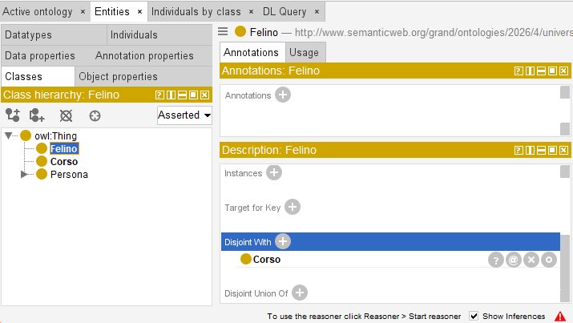
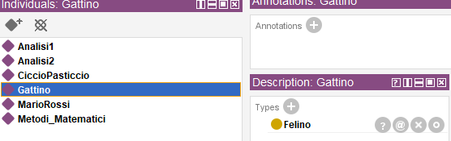
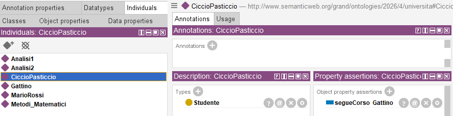
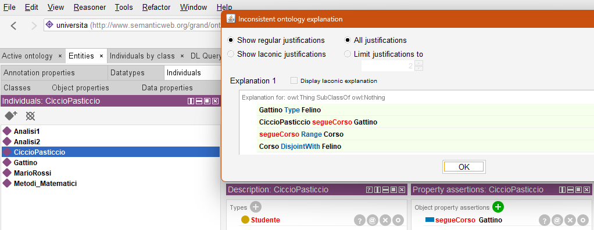

# 11. Disgiunzione (disjoint)

### Ultimo aggiornamento del 20 Maggio 2026 alle ore 12:02

---

Quando due o più classi, proprietà oggetto e proprietà dato sono disgiunte, vuol dire che non hanno nulla in comune, pertanto, non condividono alcuna istanza. 
Illustreremo come le classi <code>Corso</code> e <code>Felino</code> non hanno nulla in comune.

Clicchiamo su <b>Entities</b> > <b>Classes</b> > creiamo una classe <code>Felino</code> > nel riquadro <b>Description</b> clicchiamo il + vicino a <b>Disjoint With</b> e scriviamo <code>Corso</code>. 

Adesso, andiamo su <b>Entities</b> > <b>Individuals</b> > creiamo l'individuo <b>Gattino</b> > assegniamo la classe <code>Felino</code> all'individuo <code>Gattino</code> 

Adesso, diciamo a Protégé che l'individuo <code>CiccioPasticcio</code> di tipo <code>Studente</code> segue il corso <code>Gattino</code>  (se dimenticherete questo passo, HermiT inferirà che <code>Gattino</code> è un <code>Corso</code>, ed è il motivo per cui stavo per sputare l'acqua sulla tastiera) 
 

Come da schermata, verremo subito avvertiti dell'inconsistenza della nostra ontologia. 
 

________________
<h3><a href="./12_costr_logici.md">Passa al capitolo successivo</a></h3>
<h3><a href="./10_ragionatore_catlog.md">Ritorna al capitolo precedente</a></h3>
<h3><a href="../README.md">Ritorna all'indice</a></h3>