# 12. Costruttori logici (restrizioni di proprietà): [some](#costsomes), [only](#costonly), [exactly](#costexctl), [min](#minmax), [max](#minmax)

### Ultimo aggiornamento del 20 Maggio 2026 alle ore 16:45

---

I costruttori logici sono fondamentali per spiegare al reasoner i vincoli del mondo reale. 
La sintassi di base è  
<b>Proprietà</b> - <b>Parola Chiave</b> - <b>Tipo di dato</b>. 
Per esempio,  
hasMatricola <b>exactly 1</b> xsd:Integer  
significa che un individuo deve avere una e una sola matricola composta esclusivamente da numeri interi (1234567890).

<h3>Il costruttore <i>some</i> (restrizione esistenziale)</h3>

 Si definisca studente un individuo che deve seguire almeno un corso. 

La parola chiave <code>some</code> corrisponde al simbolo $\exists$ e significa <b>"almeno uno"</b>. 
Nell'esempio che segue, serve per dire al reasoner che uno studente segue <b>ALMENO</b> un corso. 

Per inserire una restrizione esistenziale <code>some</code>:
<ol>
<li>Clicchiamo su <b>Entities</b> > <b>Classes</b> > clicchiamo sulla classe <b>Studente</b>;</li>
<li>nel riquadro <b>Description</b> clicchiamo sulla + a destra di <b>SubClass Of</b>;</li>
<li>digitiamo <code>segueCorso some Corso</code>, infine confermiamo.</li>
</ol>

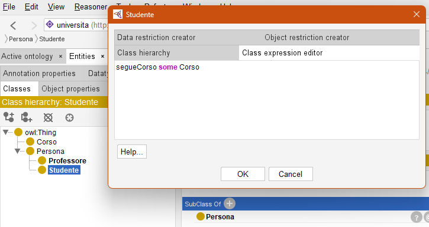 
Apparirà quindi una nuova riga nella sezione <b>SubClass Of</b> di <b>Studente</b>

Poiché il ragionatore vede che <code>CiccioPasticcio</code> è uno <code>Studente</code>, non riceveremo alcun errore: HermiT ipotizza che <code>CiccioPasticcio</code>, data la sua appartenenza alla classe <code>Studente</code>, segua <b>ALMENO</b> un corso. 
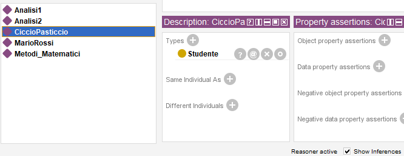

<h3>Il costruttore <i>only</i> (restrizione universale)</h3>

La restrizione universale <b>only</b> significa "solo ed esclusivamente" e si indica con ∀ 

Per fare un esempio, introduciamo due nuove classi nell'ontologia:
<ol>
<li>una classe <code>CorsoTelematico</code> sorella di <code>Corso</code> e disgiunta da essa;

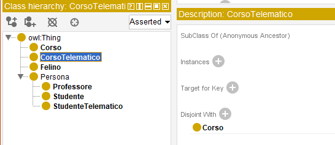
</li>
<li><code>StudenteTelematico</code>, figlia di <code>Persona</code>, con SubClass Of <code>Persona</code> e <code>segueCorso only CorsoTelematico</code> di cui <code>CiccioPasticcio</code> è un'istanza (attenzione, <code>CiccioPasticcio</code> è SOLO uno <code>StudenteTelematico</code> e non uno <code>Studente</code>).

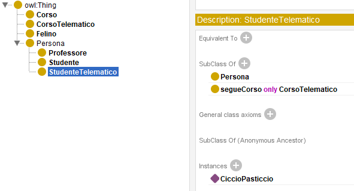
</li>
</ol>

All'avvio del reasoner, vedremo che <b>StudenteTelematico</b> può seguire solo un <b>CorsoTelematico</b>, anche perché nel <a href="./04_creazione_proprieta.md">capitolo 4</a> abbiamo definito <code>Corso</code> come <b>range</b> di <code>segueCorso</code>. 
Inoltre, Analisi I appartiene alla classe <code>Corso</code>. 
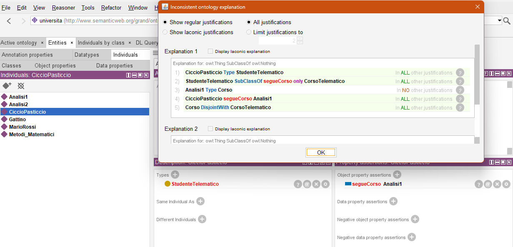

<h3>Il costruttore <i>exactly</i> (cardinalità esatta)</h3>

<b>exactly</b> ci permette di fissare un numero ben preciso di relazioni che un individuo può avere con una determinata proprietà. 

Aggiungere una restrizione di tale tipo non è difficile: basta specificarla come sottoclasse di una <b>classe</b>. 
In questo esempio, abbiamo specificato che la <b>classe</b> <code>Studente</code> può contenere esattamente un solo dato <code>haMatricola</code> di tipo xsd:integer. 
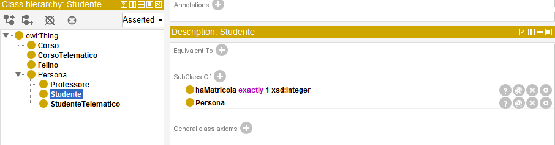

Se proveremo ad assegnare più di una matricola a <code>CiccioPasticcio</code>, il reasoner andrà semplicemente in errore come da schermata.
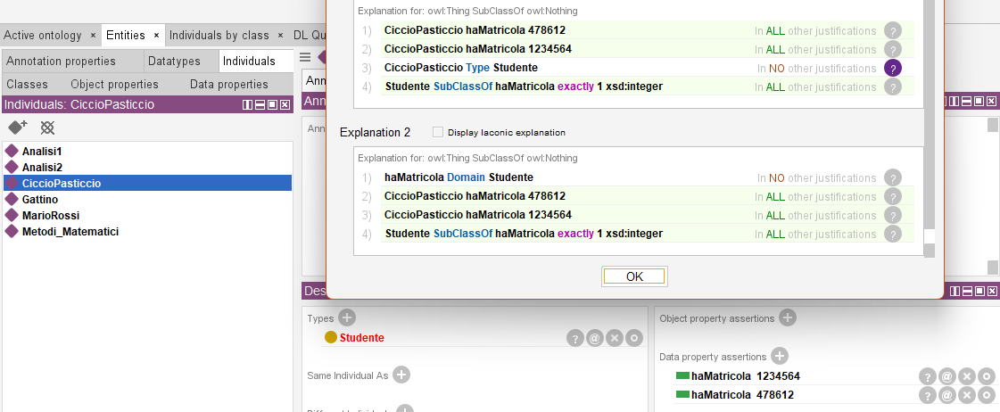

<h3>Il costruttore <i>min</i> e <i>max</i> (cardinalità minima e massima)</h3>

<b>min</b> = minimo 
<b>max</b> = massimo 
Facciamo qualche esempio pratico e dimostriamo la fallibilità di HermiT dinanzi al costrutto max. 
Dovremo performare alcune azioni nella nostra ontologia al fine di creare le circostanze adatte:
<ol>
<li>andiamo su <b>Entities</b> > <b>Classes</b> > creiamo una <b>classe</b> <code>Tesi</code>;</li>
<li>creiamo tre <b>individui</b> <code>TesiA, TesiB, TesiC</code> appartenenti alla <b>classe</b> <code>Tesi</code> e chiariamo che sono individui diversi tra loro col menù <b>Different Individuals</b> (basterà farlo una sola volta, si consiglia di selezionare le altre due tesi con il tasto CTRL o MAIUSC);

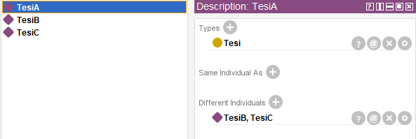
</li>
<li>andiamo su <b>Entities</b> > <b>Classes</b> > creiamo una <b>classe</b> <code>Professore</code> figlia della <b>classe</b> <code>Persona</code>;</li>
<li>andiamo su <b>Entities</b> > <b>Object properties</b> > creiamo una <b>proprietà oggetto</b> <code>relatoreDi</code> > impostiamo <code>Professore</code> come <b>Dominio</b> > impostiamo <code>Tesi</code> come <b>Range</b>;

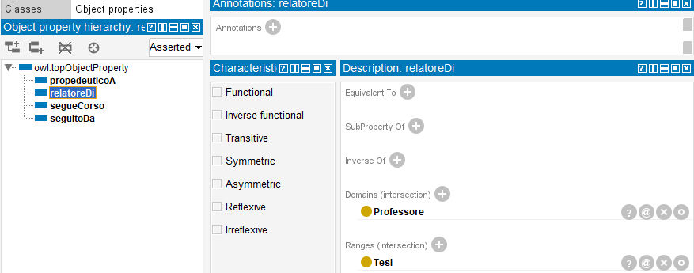
</li>
<li>creiamo un <b>individuo</b> <code>ProfPico</code> appartenente alla <b>classe</b> <code>Professore</code>, poi aggiungiamo le tre <b>asserzioni</b> visibili sulla parte destra della schermata;

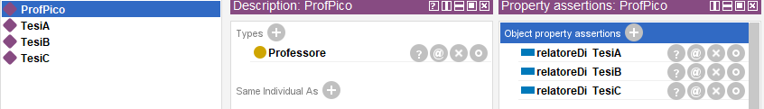
</li>
<li>torniamo alla <b>classe</b> <code>Professore</code> e definiamo il limite <code>relatoreDi max 2 Tesi</code>

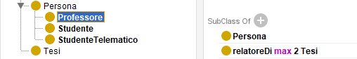
</li>
</ol>
Adesso, avviamo il reasoner.

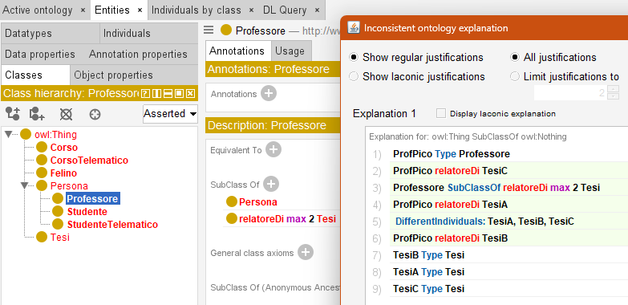 
Il costrutto <b>max</b> sta funzionando alla perfezione: il professore Pico può essere relatore di <b>massimo</b> due tesi. 
Vi basterà togliere una tesi dalle asserzioni dell'individuo <code>ProfPico</code> [(schermata al punto 5)](#punto5pp) per far tornare il reasoner alla normalità. 

Per quel che riguarda <b>min</b>, invece, il reasoner NON fallirà assolutamente nel caso in cui, per esempio, dovessimo impostare <code>relatoreDi min 2 Tesi</code> e l'individuo <code>ProfPico</code> come relatore di una sola tesi: HermiT inferirà a priori che <code>ProfPico</code> sia relatore di minimo due tesi. 

________________
<h3><a href="https://www.youtube.com/watch?v=dQw4w9WgXcQ">Passa al capitolo successivo</a></h3>
<h3><a href="./11_disgiunzione.md">Ritorna al capitolo precedente</a></h3>
<h3><a href="../README.md">Ritorna all'indice</a></h3>